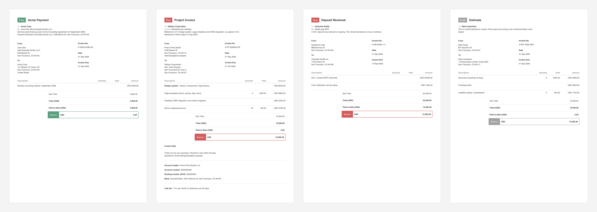

<div align="center">

# innnvoice

**Beautiful PDF invoices from one JSON file. Zero dependencies.**

One Node script. One JSON template. One command → a clean, print-ready A4 PDF.
Or skip the terminal: **[open the web editor →](https://invoice.awais.dev)**, fill in the form, click **Download PDF**.

[](LICENSE)
[](https://www.npmjs.com/package/innnvoice)
[](https://nodejs.org)
[](innnvoice)



</div>

---

## Why

Invoicing apps want a subscription, an account and your client list. Word templates break the moment you add a line item. **innnvoice** is a single ~500 line file that writes PDF bytes directly, with no Chrome, no LaTeX and no `npm install`.

- **Zero dependencies.** Only Node built-ins (`fs`, `zlib`, `util`).
- **One template, every month.** Placeholders like `{Month} {year}` fill in themselves.
- **Four statuses.** Paid, Due, Unpaid and Draft, each with its own color.
- **Real totals.** Line items, quantities, partial payments and balance due.
- **Any currency.** USD, EUR, GBP, PKR, or any other code you put in.
- **Private by default.** Bank details and notes stay off the PDF until you ask for them.
- **Browser editor too.** `innnvoice.html` is one offline file with a form, a live preview and a Download PDF button.
- **Tiny output.** Each PDF is about 2–4 KB and uses standard Helvetica, so it opens anywhere.

## Quick start

```bash
npx innnvoice init    # creates innnvoice.json in this folder
# Add your details to innnvoice.json, then:
npx innnvoice
```

```
✓ 2026-Acme-Oct · 01 Oct 2026 · USD 0.00 · PAID
  /path/to/folder/invoices/2026/10-2026-Acme-Oct.pdf
```

That's it. Requires **Node 18+**.

Install it globally to drop the `npx`:

```bash
npm i -g innnvoice
innnvoice init && innnvoice
```

Or run it straight from a clone: `git clone https://github.com/ahmadawais/innnvoice.git && cd innnvoice && ./innnvoice`.

## Browser editor

Prefer a form? Use it online at **[invoice.awais.dev](https://invoice.awais.dev)**, or run it locally: `innnvoice.html` is a single self-contained file. Open it in any browser, fill it in, and click **Download PDF**.

```bash
npx innnvoice html --open    # writes ./innnvoice.html and opens it
```

- **Live preview** of the real PDF as you type.
- **Same renderer as the CLI**, copied in at build time, so the PDFs match exactly.
- **Import / Export JSON** that works with the CLI template format.
- **Offline and private.** Nothing loads from the network, and your work is saved in your browser.

You can also download [`innnvoice.html`](innnvoice.html) from this repo and double-click it.

## Usage

Run it with `npx innnvoice`, or install it once with `npm i -g innnvoice` and drop the `npx`.

```bash
npx innnvoice init                # create ./innnvoice.json to edit
npx innnvoice html                # create ./innnvoice.html, the browser editor
npx innnvoice                     # paid invoice dated the 1st of this month
npx innnvoice 2026-09             # dated 01 Sep 2026
npx innnvoice 2026-09-15          # dated 15 Sep 2026
npx innnvoice 2026-09 --due       # red "Due" badge, full balance owing
npx innnvoice 2026-09 --draft     # grey "Draft", saved as *-DRAFT.pdf
npx innnvoice --amount 6500       # override the first line item's rate
npx innnvoice --note --bank       # include the invoice note and bank details
npx innnvoice -t client-b.json    # use a different template
npx innnvoice --open              # open the PDF when done (macOS)
```

### Statuses

| Flag | Badge | Paid to date | Balance |
| --- | --- | --- | --- |
| `--paid` *(default)* | 🟢 Paid | Total | 0.00 |
| `--due` | 🔴 Due | Template `paid` (or `--paid-amount`) | Remaining |
| `--unpaid` | 🔴 Unpaid | Template `paid` (or `--paid-amount`) | Remaining |
| `--draft` | ⚪ Draft | Template `paid` (or `--paid-amount`) | Remaining |

### Options

| Option | Description |
| --- | --- |
| `-t, --template <file>` | Template JSON (default: `./innnvoice.json`) |
| `-d, --date <date>` | Invoice date, `YYYY-MM` or `YYYY-MM-DD` (default: 1st of this month) |
| `--due-date <date>` | Due date (default: same as invoice date) |
| `-a, --amount <n>` | Override the rate of the first line item |
| `--paid-amount <n>` | Amount paid to date |
| `-o, --out <file>` | Output path (default: template `output`) |
| `-f, --force` | Overwrite an existing PDF |
| `--note` | Show the Invoice Note and footer (hidden by default) |
| `--bank` | Show payment/bank details (hidden by default) |
| `--open` | Open the PDF when done |
| `-h, --help` | Show help |

## Examples

The [`examples/`](examples) folder has nine ready-to-copy templates, each with its JSON, PDF and preview:

| | | |
| :---: | :---: | :---: |
| <a href="examples/minimal"></a><br>**[Minimal](examples/minimal)** | <a href="examples/freelance-retainer"></a><br>**[Freelance retainer](examples/freelance-retainer)** | <a href="examples/agency-project"></a><br>**[Agency project](examples/agency-project)** |
| <a href="examples/hourly-consulting"></a><br>**[Hourly consulting](examples/hourly-consulting)** | <a href="examples/partial-payment"></a><br>**[Partial payment](examples/partial-payment)** | <a href="examples/draft-quote"></a><br>**[Draft quote](examples/draft-quote)** |
| <a href="examples/eur-design-studio"></a><br>**[EUR design studio](examples/eur-design-studio)** | <a href="examples/open-source-sponsorship"></a><br>**[OSS sponsorship](examples/open-source-sponsorship)** | <a href="examples/photography-session"></a><br>**[Photography session](examples/photography-session)** |

```bash
npx innnvoice 2026-09 -t examples/agency-project/invoice.json -o agency.pdf
./examples/build.sh    # regenerate every example PDF + preview
```

## Template reference

Everything lives in `innnvoice.json`. Only `items` is required.

| Field | Type | Description |
| --- | --- | --- |
| `output` | string | Output path, relative to the template. Default `invoice-{year}-{MM}.pdf` |
| `title` | string | Heading next to the status badge. Default `Invoice` |
| `intro` | string[] | Lines under the title. `Label: value` lines get a muted label; longer lines wrap |
| `from` | string[] | Your name and address |
| `to` | string[] | Client name and address |
| `invoiceNo` | string | Invoice number. Default `{year}-{MM}` |
| `date` | string \| null | Fixed invoice date `YYYY-MM-DD`; `null` uses the CLI/current month |
| `due` | string \| null | Fixed due date `YYYY-MM-DD`; `null` means same as the invoice date |
| `currency` | string | Currency code shown on amounts. Default `USD` |
| `items` | object[] | `{ "description", "quantity", "rate" }`. Quantity/rate columns only show when quantity ≠ 1 |
| `paid` | number | Amount already paid (for due/unpaid/draft). Default `0` |
| `status` | string | `paid`, `due`, `unpaid` or `draft`. A CLI flag overrides it |
| `statusColors` | object | Override badge colors, e.g. `{ "paid": "#2563eb" }` |
| `showNote` | boolean | Show `notes` and `footer` without needing `--note` |
| `showBank` | boolean | Show `details` without needing `--bank` |
| `notes` | string[] | Paragraphs under "Invoice Note" |
| `details` | string[] | Payment/bank detail lines |
| `footer` | string | Closing line, shown with the note |

### Placeholders

Use these in any string and they're filled in from the invoice date:

| Placeholder | Example |
| --- | --- |
| `{year}` | `2026` |
| `{Month}` | `September` |
| `{mon}` | `Sep` |
| `{month}` | `9` |
| `{MM}` | `09` |
| `{DD}` | `01` |

Wrap text in `**double asterisks**` to make it **bold**.

## How it works

innnvoice lays the page out on a 1752-unit grid and writes PDF drawing operators by hand: text runs, rectangles and rounded corners drawn as Bézier curves. It measures word wrap with the Helvetica AFM glyph widths, compresses the content stream with `zlib`, and builds the xref table byte by byte. Because it uses the PDF base-14 fonts, nothing gets embedded, and the file stays a few kilobytes.

## FAQ

**Does it support non-Latin scripts?** It supports the WinAnsi (Latin-1) range, which covers English and most Western European languages. Other characters are replaced with `?`.

**Multiple clients?** Keep one template per client (`acme.json`, `globex.json`) and pass `-t`.

**Will it overwrite my invoice?** No. It refuses unless you pass `--force`.

**Windows?** `npx innnvoice` works everywhere Node does. `--open` uses macOS `open`.

## Contributing

Keep it zero-dependency and single-file.

```bash
npm test         # renderer, CLI, examples, HTML sync, and a browser test
npm run build    # rebuild innnvoice.html and every example PDF + preview
```

- The renderer lives in the `// <core>` block of [`innnvoice`](innnvoice). [`scripts/build-html.js`](scripts/build-html.js) copies it into `innnvoice.html`, so edit it in one place and run `npm run build`.
- The tests use Node's built-in `node:test`. The browser test runs only when [agent-browser](https://github.com/vercel-labs/agent-browser) is installed and is skipped otherwise.
- If you change the layout, commit the rebuilt example PDFs and previews. `npm test` fails while they're stale.

## License

[MIT](LICENSE) © [Ahmad Awais](https://github.com/ahmadawais)
