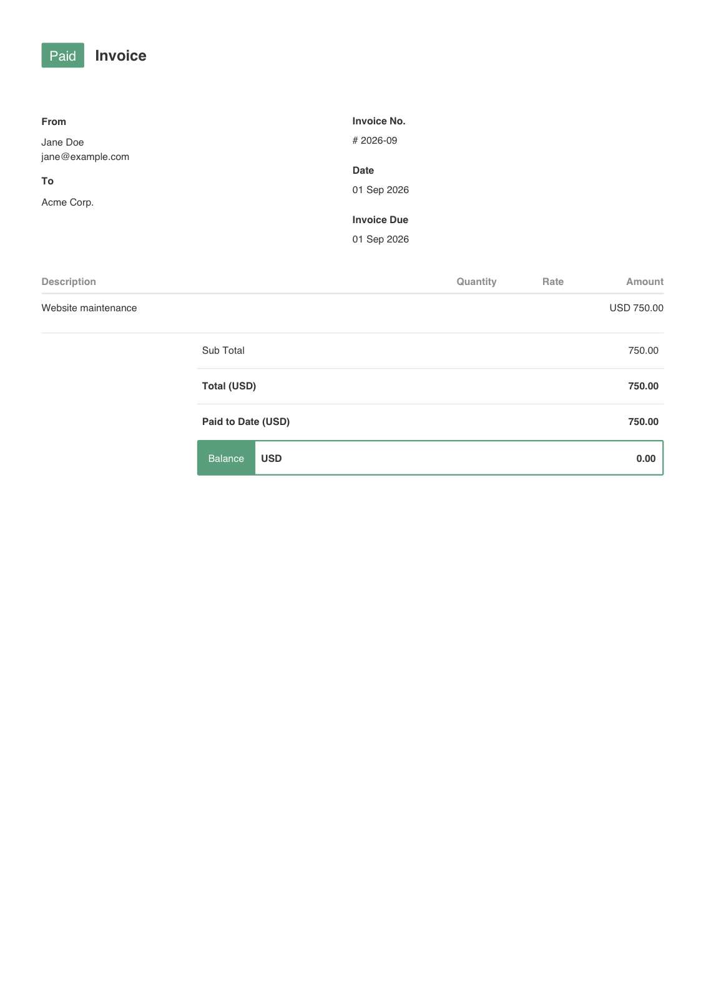
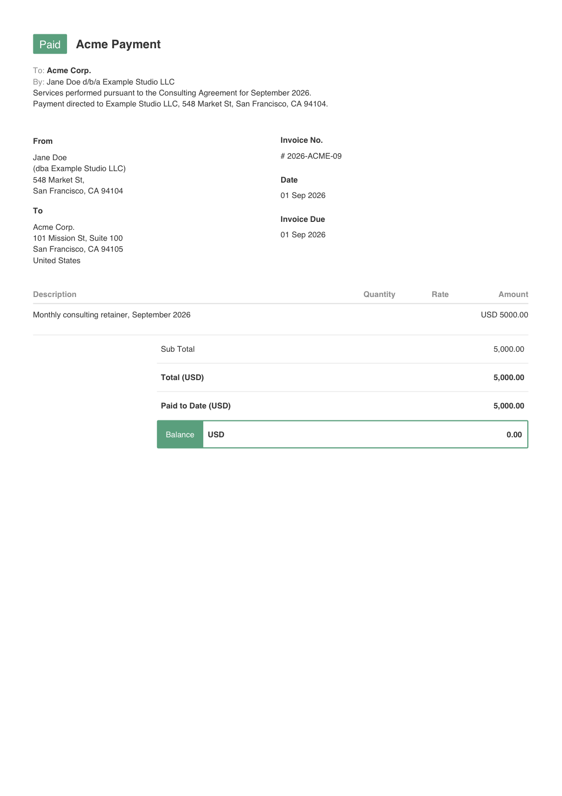
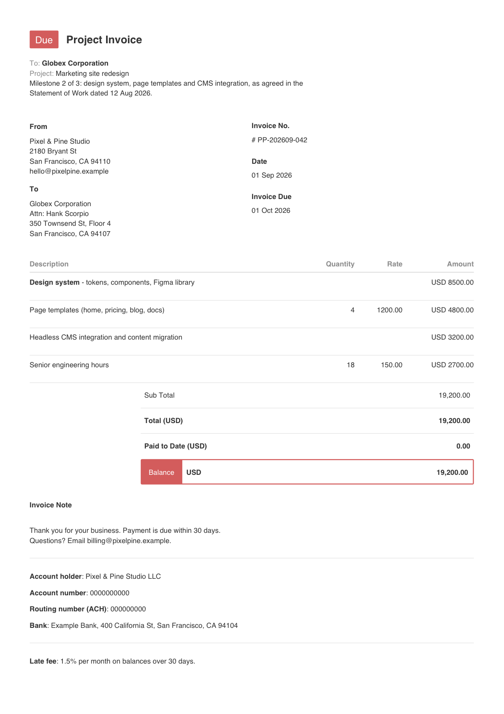
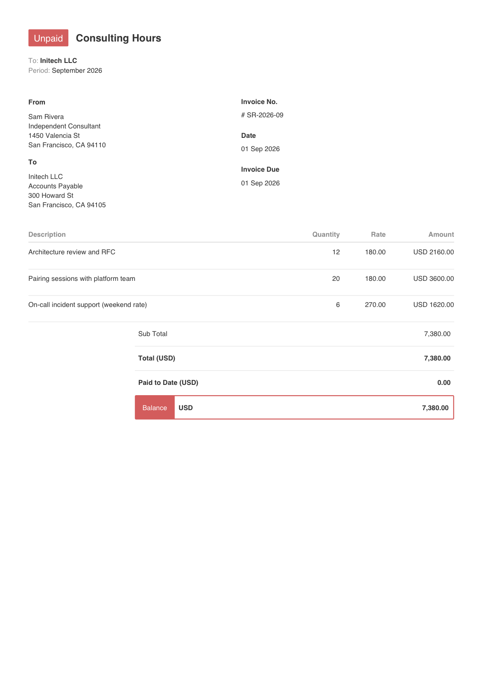
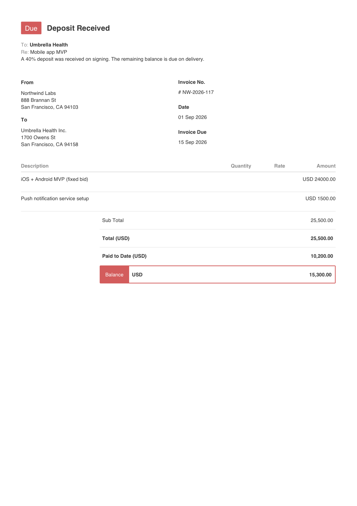
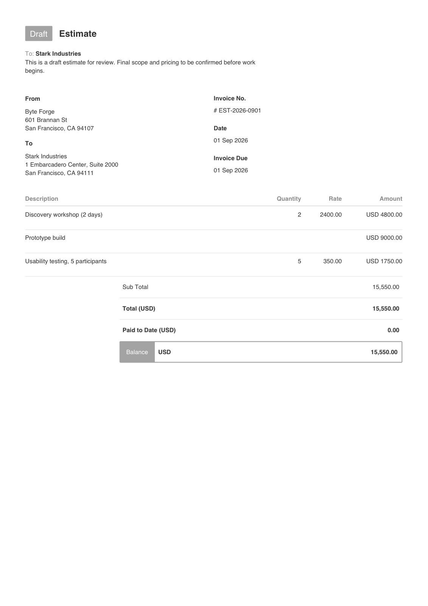
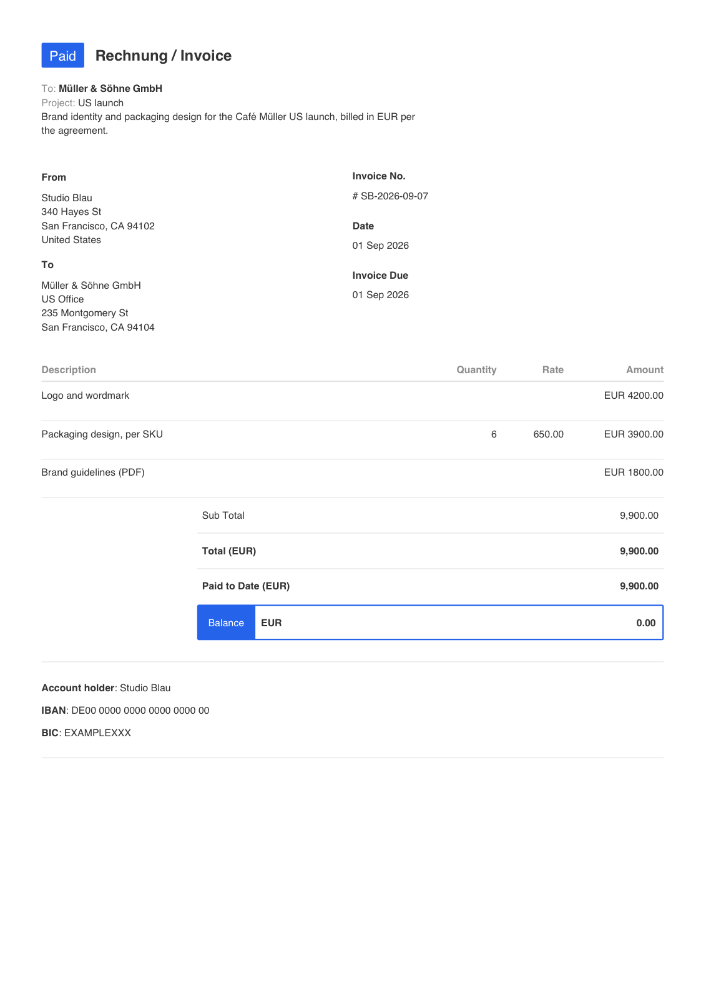
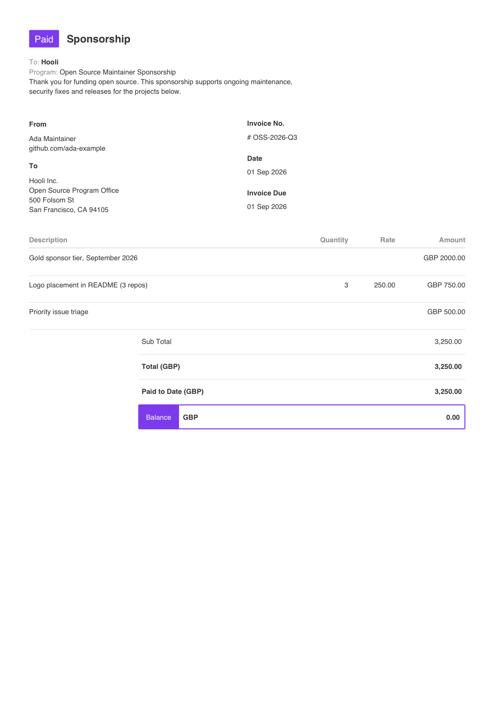
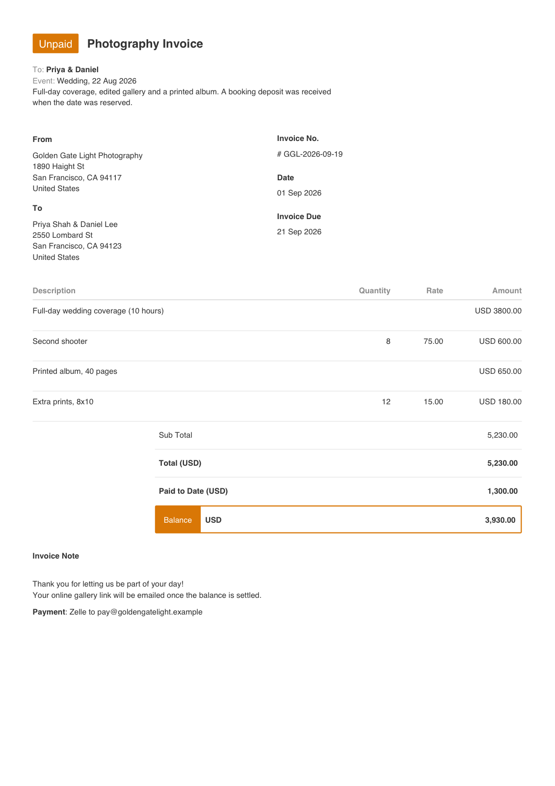

# Examples

Nine ready-to-copy templates, each with its JSON, the generated PDF and a PNG preview. Every example here is dated September 2026.

Regenerate them all (on macOS this also refreshes the previews and the gallery):

```bash
./examples/build.sh            # dated Sep 2026
./examples/build.sh 2026-10    # dated Oct 2026
```

Or render any single one:

```bash
npx innnvoice 2026-09 -t examples/agency-project/invoice.json -o agency.pdf
```

| Example | Shows | Status |
| --- | --- | --- |
| [`minimal`](#minimal) | The smallest valid template | Paid |
| [`freelance-retainer`](#freelance-retainer) | Monthly retainer, `{Month}` placeholders, custom output path | Paid |
| [`agency-project`](#agency-project) | Multi-line items, quantities, bold text, note, bank details, footer | Due |
| [`hourly-consulting`](#hourly-consulting) | Hours × rate billing | Unpaid |
| [`partial-payment`](#partial-payment) | Deposit received, balance outstanding | Due |
| [`draft-quote`](#draft-quote) | An estimate marked Draft | Draft |
| [`eur-design-studio`](#eur-design-studio) | EUR billing, accented characters, IBAN, custom badge colors | Paid |
| [`open-source-sponsorship`](#open-source-sponsorship) | GBP, sponsorship tiers, purple badge | Paid |
| [`photography-session`](#photography-session) | Deposit, note + footer without bank details, amber badge | Unpaid |

---

## minimal

Only `from`, `to` and `items` are really needed. Everything else has a sensible default.

```json
{
  "title": "Invoice",
  "from": ["Jane Doe", "jane@example.com"],
  "to": ["Acme Corp."],
  "currency": "USD",
  "items": [{ "description": "Website maintenance", "quantity": 1, "rate": 750 }]
}
```

[JSON](minimal/invoice.json) · [PDF](minimal/invoice.pdf)



## freelance-retainer

One fixed monthly fee. `{Month} {year}` in the description and invoice number update automatically for whatever month you pass.

```bash
npx innnvoice 2026-09 -t examples/freelance-retainer/invoice.json
```

[JSON](freelance-retainer/invoice.json) · [PDF](freelance-retainer/invoice.pdf)



## agency-project

Several line items. Quantity and Rate only appear when the quantity is not 1. `"showNote": true` and `"showBank": true` turn on the note, the bank details and the footer.

```bash
npx innnvoice 2026-09 -t examples/agency-project/invoice.json
```

[JSON](agency-project/invoice.json) · [PDF](agency-project/invoice.pdf)



## hourly-consulting

Bill by the hour: `quantity` is hours and `rate` is the hourly rate.

```bash
npx innnvoice 2026-09 -t examples/hourly-consulting/invoice.json --unpaid
```

[JSON](hourly-consulting/invoice.json) · [PDF](hourly-consulting/invoice.pdf)



## partial-payment

`"paid": 10200` records a deposit, and the balance shows what's still owed. You can also set it per run with `--paid-amount 10200`.

```bash
npx innnvoice 2026-09 -t examples/partial-payment/invoice.json --due --paid-amount 10200
```

[JSON](partial-payment/invoice.json) · [PDF](partial-payment/invoice.pdf)



## draft-quote

A grey Draft badge, useful for estimates. Without `--out`, drafts are saved as `*-DRAFT.pdf` so they never overwrite the real invoice.

```bash
npx innnvoice 2026-09 -t examples/draft-quote/invoice.json --draft
```

[JSON](draft-quote/invoice.json) · [PDF](draft-quote/invoice.pdf)



## eur-design-studio

Any currency code works. Latin-1 characters (ä ö ü ß é ñ …) render natively, and `statusColors` restyles the badge and balance bar.

```json
"currency": "EUR",
"statusColors": { "paid": "#2563eb", "due": "#ea580c" }
```

[JSON](eur-design-studio/invoice.json) · [PDF](eur-design-studio/invoice.pdf)



## open-source-sponsorship

Bill a company for sponsoring your open-source work. This one is in GBP with a purple badge.

```bash
npx innnvoice 2026-09 -t examples/open-source-sponsorship/invoice.json
```

[JSON](open-source-sponsorship/invoice.json) · [PDF](open-source-sponsorship/invoice.pdf)



## photography-session

A wedding shoot with a booking deposit already paid. `"showNote": true` shows the note and payment footer while bank details stay hidden, and the Unpaid badge is recolored amber.

```bash
npx innnvoice 2026-09 -t examples/photography-session/invoice.json
```

[JSON](photography-session/invoice.json) · [PDF](photography-session/invoice.pdf)


